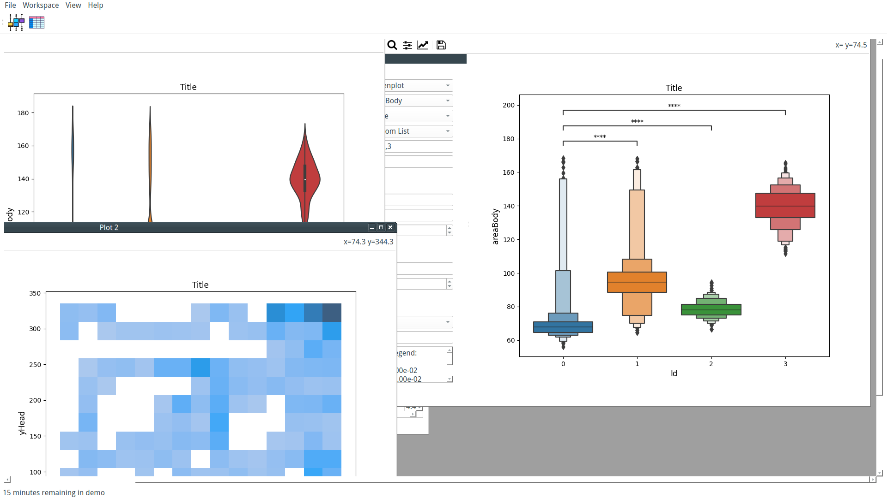
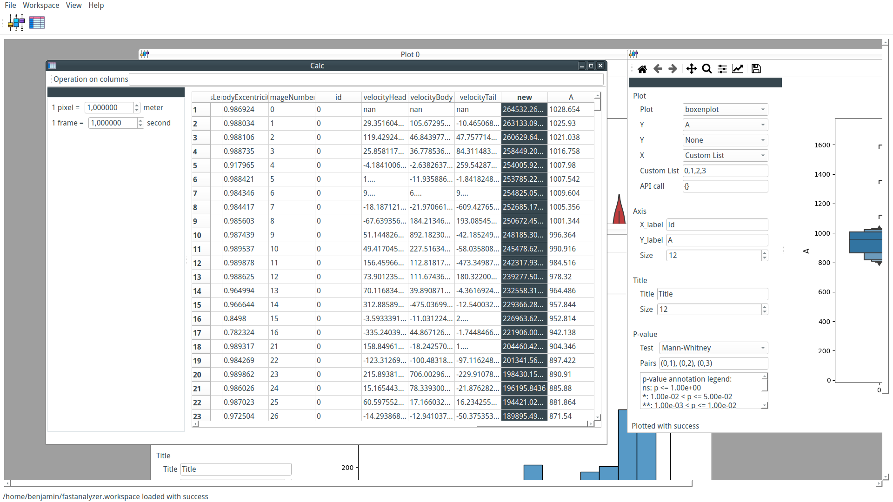

# FastAnalyzer

## About

Tracking objects from video recording is generally only the first step of any scientific analysis. The second task, trajectory analysis, can be pretty daunting. Numerous tools are available, from scripting languages to complete user interface environments that require various learning curves.

[FastTrack](https://github.com/FastTrackOrg/FastTrack) allows easy and fast tracking from any video recording. To make the trajectory analysis as fast and easy as possible, we present FastAnalyzer. FastAnalyzer is built on top of the Python scientific ecosystem (SciPy, NumPy, Matplotlib, and Seaborn) and of the existing FastAnalysis library.

## Interface

FastAnalyzer interface is an MDI. This interface allows us to see and compare several plots in one glance. That means that each new plot is a unique window inside the interface. Windows can be displayed as tabs or in separate windows (they can be tiled or cascaded). Changes in the data are directly visible in every plot window.

## Data loading
Tracking data from FastTrack (.db and .txt) can be loaded in FastAnalyzer. Once loaded, modified tracking data and plots can be saved as a "workspace" saved and can be reloaded next time. It allows the user to switch seamlessly between several analyses.

## Data modification
Tracking data can be modified using the Calc window. New columns can be created using columns operation. for example, new = xHead\*\*2 will create a new column named new. Regular Pandas operations are supported like sqrt(), diff(), etc. It is also possible to apply a scale to the tracking data to convert pixels and images in meters and seconds.

## Data statistical significance
P-values calculation using several standard tests are implemented. Choose the test, write the pair where you want to test, for example, (0,1), (0,2), and FastAnalyzer will directly draw the result on the plot and the detail of the test in the interface.

## Installation
1. Binaries for Windows, Linux and MacOs.
2. `pip install fastanalyzer`

## Get help

If you need help, please contact benjamin.gallois@fasttrack.sh or open an issue or a discussion on GitHub.

